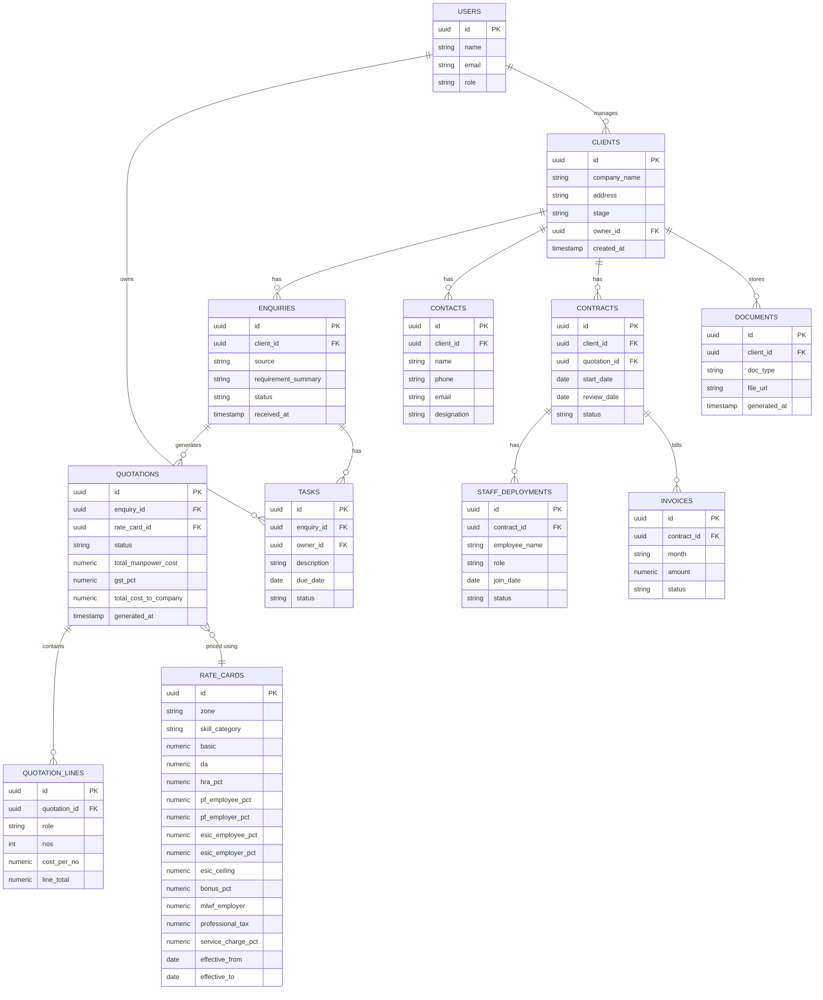

# Integrix Enquiry Management & CRM — Technical Specification

**Prepared for:** Integrix Facility Services LLP
**Prepared by:** Simranjeet Singh, with Claude
**Version:** 1.0 — Draft build brief
**Date:** 11 July 2026

---

## 1. Purpose & Scope

A hosted web application that manages the full client lifecycle — from first enquiry
through to renewal — with automated, compliance-aware quotation generation built on
the same logic as the Integrix CTC Calculator (Maharashtra minimum wage + PF/ESIC/
Bonus/MLWF/PT + service charge engine).

**Primary users:** Integrix partners and staff (2-5 people initially).
**Access:** Web browser, desktop and mobile. No native app required at launch.

**Out of scope for v1:** public client-facing self-service portal, multi-company/
multi-tenant support, accounting/GST filing (only invoice generation, not filing).

---

## 2. Recommended Stack

| Layer | Choice | Why |
|---|---|---|
| Frontend | Next.js (React, TypeScript) | Single codebase, responsive out of the box, large ecosystem |
| Backend | Next.js API routes (Node.js) | No separate backend service to run/maintain |
| Database | PostgreSQL via Supabase | Managed, generous free tier, built-in auth + storage |
| Auth | Supabase Auth | Email/password + role-based access, no separate auth service |
| File storage | Supabase Storage (or Google Drive API) | Generated PDFs, uploaded documents |
| PDF/DOCX generation | Node.js `docx` library + LibreOffice headless (already used in the CTC Calculator build) | Reuses existing, proven document-generation pipeline |
| Hosting | Vercel (app) + Supabase (data) | Zero server management, scales automatically |
| Email | Resend or SMTP relay | Sending quotations/notifications |
| E-signature (Phase 3) | Zoho Sign API | Already in the Zoho ecosystem via Zoho Payroll |
| WhatsApp (Phase 3) | Meta WhatsApp Cloud API or Interakt/Gupshup | Enquiry intake + quotation delivery |

**Estimated running cost:** ₹0–2,000/month at current scale (mostly free tiers),
rising to roughly ₹3,000–6,000/month once WhatsApp/e-signature volume grows.

---

## 3. Data Model

### 3.1 Entity Overview

### 3.2 Key Design Notes

- **`rate_cards` is versioned, never edited in place.** A new VDA notification creates
  a new row with a fresh `effective_from` date; the old row gets an `effective_to`
  date. Quotations store a foreign key to the exact rate card version used, so
  historical PDFs never drift.
- **`clients.stage`** drives the Kanban board: `enquiry`, `discovery`, `proposal`,
  `onboarding`, `execution`, `review`.
- **`quotations.status`**: `draft`, `sent`, `accepted`, `rejected`, `expired`.
- **`contracts`** is created automatically when a quotation is marked `accepted`,
  carrying over the headcount/rate details.

---

## 4. The Quotation Engine (core logic, ported from the Excel calculator)

This is the most important piece of business logic in the system — it should be
written as a single, well-tested backend function, not duplicated across pages.

**Inputs:** zone, skill category, number of positions, target take-home (or gross,
if working forward instead of backward), GST %, service charge %, rate card version
(defaults to the currently effective one).

**Steps:**
1. Look up Basic + DA for the given zone/skill from the active rate card.
2. Compute HRA (5% of Basic+DA), PF (12% employee / 12%+0.5%+0.5% employer).
3. Run the two-scenario ESIC applicability test (Scenario A: assume ESIC applies;
   Scenario B: assume it doesn't) against the Code on Social Security "Wages"
   definition (Basic+DA, or 50% of gross if allowances exceed 50%), pick whichever
   scenario is internally consistent.
4. Solve for Gross salary such that Net Take-Home = Gross − PF − ESIC − Professional
   Tax equals the target.
5. Compute employer-side costs: PF employer + EDLI + Admin + ESIC employer + Bonus
   (8.33% of Basic+DA) + MLWF.
6. Sum to Total CTC → apply service charge % → Total Manpower Cost per employee.
7. Multiply by headcount, apply GST %, output Total Cost to Company.
8. Render the branded PDF (Integrix letterhead, summary table + Annexure breakup +
   Take-Home Calculation + Terms) and attach it to the enquiry.

This logic already exists, tested, in the `Integrix_Driver_CTC_Calculator.xlsx`
workbook — it should be transcribed directly rather than re-derived.

---

## 5. Feature Inventory by Phase

### Phase 1 — Core (MVP)
- Login + role-based access (Partner/Admin, Sales, Ops)
- Client & contact database
- Enquiry intake form (manual entry; web-form/WhatsApp intake in Phase 3)
- Kanban pipeline board (6 stages)
- Rate card management screen (add/edit versions, effective dates)
- Automated quotation generator + branded PDF output
- Quotation history per client

### Phase 2 — Lifecycle depth
- Document generation for all 6 stages (reusing existing DOCX templates)
- Task/reminder system with due dates and owners
- Activity timeline per client
- Staff deployment tracking (who's placed where, since when)
- Contract creation on quotation acceptance

### Phase 3 — Automation & integration
- Invoicing (monthly, tied to contracts, end-of-month terms)
- Compliance calendar (PF/ESIC/PT/LWF due dates, auto-reminders)
- WhatsApp intake and quotation delivery
- E-signature on proposals/SLAs/offer letters (Zoho Sign)
- "Rate card updated" alerts + auto-drafted revised quotations for active clients

### Phase 4 — Reporting & polish
- Dashboard: pipeline conversion rate, revenue by client/service line, headcount by zone
- Renewal/attrition alerts (contracts approaching review date)
- Mobile layout polish
- Audit trail / version history on quotations and documents

---

## 6. Roles & Permissions (initial)

| Role | Can do |
|---|---|
| Partner/Admin | Everything, including rate card edits and user management |
| Sales | Create/manage enquiries, generate quotations, move pipeline stages |
| Ops | View contracts, manage staff deployments, mark tasks complete |

---

## 7. Integration Points

- **Zoho Payroll** — system of record for actual payroll; the CRM's rate card and
  quotation engine should stay consistent with Zoho's PF calculation method
  (documented in existing project notes). No live API integration required at launch;
  a Phase 3+ possibility is pushing new-hire data to Zoho once onboarded.
- **WhatsApp** — enquiry intake and quotation delivery channel (Phase 3).
- **Email** — quotation delivery, task reminders, compliance alerts.
- **Google Drive** (optional) — alternative/parallel document storage if preferred
  over Supabase Storage.

---

## 8. Open Decisions Before Build Starts

1. Confirm Zone II/III Skilled Basic wage figures against the official Maharashtra
   notification PDF (currently derived by pattern in the Excel calculator).
2. Confirm the ESIC new-wage-definition interpretation with a CA/labour law
   consultant before it drives live quotations.
3. Decide on Supabase Storage vs Google Drive for document storage.
4. Decide whether Phase 3 WhatsApp integration uses the official Meta Cloud API
   directly or a third-party provider (Interakt/Gupshup) — affects cost and setup time.
5. Confirm dedicated company email/phone for client-facing documents (currently
   using a partner's personal contact details).

---

## 9. Suggested Timeline

| Phase | Scope | Rough duration |
|---|---|---|
| 1 | Core pipeline + quotation engine | 3-4 weeks |
| 2 | Documents, tasks, staff tracking | 2-3 weeks |
| 3 | Invoicing, compliance calendar, WhatsApp, e-sign | 3-4 weeks |
| 4 | Dashboard, renewals, polish | 2 weeks |

Timelines assume iterative development with Claude Code, with working software
reviewable at the end of each phase rather than a single big-bang release.

---

## 10. Next Step

Hand this document to Claude Code as the build brief for Phase 1, starting with:
project scaffolding (Next.js + Supabase), the `rate_cards` and `clients`/`enquiries`
tables, and the quotation engine ported from the Excel workbook.
